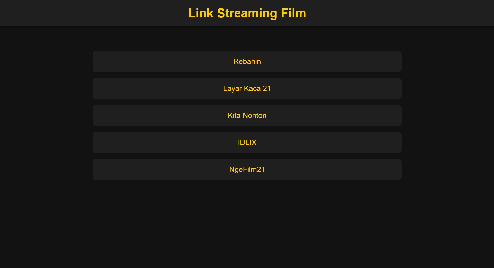

# Golden Movie Hub - Premium Streaming Links



## Description

**Golden Movie Hub** is a premium streaming directory designed to provide users with easy access to the latest and best streaming links for movies and TV series. Curated by [Your Name], this platform offers a seamless experience for film enthusiasts looking to stream movies online, with categorized links for both Indonesian and international films.

## Features

- **User-Friendly Interface:** A clean, modern design with easy navigation.
- **Curated Links:** Direct links to popular streaming sites such as Rebahin, Layar Kaca 21, Kita Nonton, IDLIX, and NgeFilm21.
- **Filters:** Ability to filter streaming platforms by Indonesian or international films.
- **Enhanced User Experience:** Smooth hover effects and a modern dark theme.
- **Responsive Design:** The website adapts to various screen sizes for optimal viewing on all devices.
- **ARIA Labels:** Added for better accessibility.

## Technologies Used

- **HTML5:** For structuring the content.
- **CSS3:** For styling, including animations and transitions.
- **JavaScript:** For interactivity and filter functionality.
- **Responsive Design:** Ensures the website looks great on both desktop and mobile devices.

## Getting Started

To get a local copy of the project up and running, follow these steps:

### Prerequisites

Ensure you have the following installed:

- A web browser (Google Chrome, Firefox, Safari, etc.)
- A text editor (VS Code, Sublime Text, Notepad++, etc.)

### Installation

1. **Clone the repository:**
   ```bash
   git clone https://github.com/yourusername/golden-movie-hub.git
   ```

2. **Navigate to the project directory:**
   ```bash
   cd golden-movie-hub
   ```

3. **Open the `index.html` file in your browser:**
   ```bash
   open index.html
   ```

## Usage

1. **Homepage:** The homepage features the website’s title and a filtering system for easy browsing.
2. **Filter Movies:** Use the filter buttons to view Indonesian or international films or all available links.
3. **Explore Streaming Sites:** Click on any movie card to be directed to the corresponding streaming platform.

## Preview

Here is how the website looks:

- **Header:** The title "Golden Movie Hub" in bright gold, with a sleek design.
- **Filters:** Toggle between "All," "Streaming Film Indonesia," and "Streaming Film Luar Negeri."
- **Movie Cards:** Each card represents a streaming platform, offering a brief description.
- **Hover Effects:** The movie cards highlight with a golden background and smooth transition when hovered over.

## Contributing

Feel free to fork the repository, open issues, or submit pull requests to improve the project.

## License

This project is open source and available under the [MIT License](LICENSE).
